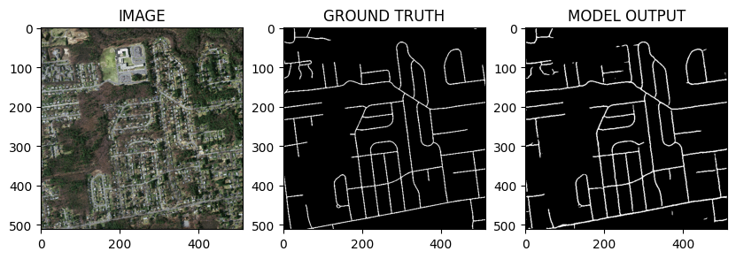

# Aerial Image Segmentation Project

*A project completed under the **Coursera Project Network** by*

**Siddhant Chourasia**

B.Tech | Electrical Engineering | IIT Bombay

Certificate of Completion: [View Certificate](Coursera%20AT4Z2GMW5FEM.pdf)

---




# Aerial Image Segmentation Project - Overview

## Overview

Aerial image segmentation is a computer vision task that involves dividing aerial images into meaningful regions or segments. In this project, we aim to develop a robust and accurate segmentation model to identify roads in aerial images. The ability to accurately detect roads from aerial imagery has numerous applications, such as urban planning, traffic management, and disaster response.

## Dataset

The dataset used in this guided project is a subset of the Massachusetts Roads Dataset. It comprises 200 aerial images along with their corresponding road masks. Each image is 1500x1500 pixels in size, covering an area of approximately 2.25 square kilometers. The road masks are binary masks where the pixels belonging to roads are labeled as 1, and non-road pixels are labeled as 0.

The full dataset, which contains 1171 aerial images, is publicly available and can be accessed from the following link: [Full Dataset](https://www.cs.toronto.edu/~vmnih/data/).

## Environment Setup

The project is implemented in a Google Colab GPU runtime environment to leverage the computational power of GPUs for faster training. To ensure all required dependencies are available, we install the necessary packages using the following commands:

```python
!pip install segmentation-models-pytorch
!pip install -U git+https://github.com/albumentations-team/albumentations
!pip install --upgrade opencv-contrib-python
```

## Configurations

Several configurations are essential for the successful execution of the project:

- **CSV_FILE**: Path to the CSV file containing image and mask file paths.
- **DATA_DIR**: Directory containing the dataset.
- **DEVICE**: Device to run the model (e.g., 'cuda' for GPU).
- **EPOCHS**: Number of training epochs.
- **LR**: Learning rate for the optimizer.
- **BATCH_SIZE**: Batch size for data loading.
- **IMG_SIZE**: Size of the input images.
- **ENCODER**: Encoder architecture for the segmentation model.
- **WEIGHTS**: Pretrained weights for the encoder.

## Augmentation

Data augmentation is crucial to improve the model's generalization and make it robust to various data variations. In this project, we use the Albumentations library for image transformations, which includes resizing, horizontal flipping, and vertical flipping.

## Custom Dataset

To effectively load and preprocess the data for training, we create a custom dataset class called `SegmentationDataset`. This class is responsible for loading the aerial images and their corresponding masks, applying data augmentation if specified, and returning the preprocessed image and mask tensors.

## DataLoader

To efficiently handle the large dataset, we utilize PyTorch's DataLoader, which helps load the custom datasets in batches. We create separate loaders for the training and validation datasets to process data efficiently during training.

## Segmentation Model

The core of this project is the segmentation model, which is based on the Unet architecture. The Unet model consists of an encoder network and a decoder network. In our case, we use a pre-trained EfficientNet-B0 as the encoder backbone, which helps the model learn rich and meaningful features from the input images.

The segmentation model architecture can be described as follows:

- **Input**: RGB aerial image of size (C, H, W) where C is the number of channels (3 for RGB), H is the image height, and W is the image width.
- **Encoder**: EfficientNet-B0 is used as the encoder backbone, which processes the input image and extracts high-level features. The encoder network is pretrained on ImageNet, enabling it to learn meaningful representations from natural images.
- **Decoder**: The decoder network reconstructs the segmented output from the encoded features. It consists of transpose convolutions (upsampling) and skip connections from the encoder to retain spatial information and improve segmentation accuracy.
- **Output**: The model predicts the road mask, which is a binary mask of size (1, H, W), where each pixel represents the probability of being a road (1) or non-road (0).

## Train and Validation Functions

To train the segmentation model effectively, we define two functions: the `train_fn` and `eval_fn`. The `train_fn` handles the training process, including the forward pass, loss calculation, and backpropagation, while the `eval_fn` is responsible for evaluating the model's performance on the validation dataset.

## Training the Model

The model training process involves iterating through the training dataset for a fixed number of epochs. We use the Adam optimizer with the specified learning rate to update the model parameters during training. Additionally, we implement early stopping by saving the best model based on the validation loss.

During training, some values to monitor include:

- **Training Loss**: The average loss computed during each epoch while training the model on the training dataset.
- **Validation Loss**: The average loss computed during each epoch while evaluating the model on the validation dataset.
- **Best Model**: The model with the lowest validation loss is saved as the best model to be used for inference.

## Inference

After training the model, we load the best model weights and perform inference on sample images from the validation set. The model predicts segmentation masks for these images, and we compare them with the ground truth masks to visualize the model's performance.

*Note: While the actual code for the entire project is available in the implementation, this overview provides a high-level description of each step and its significance in the aerial image segmentation project.*
